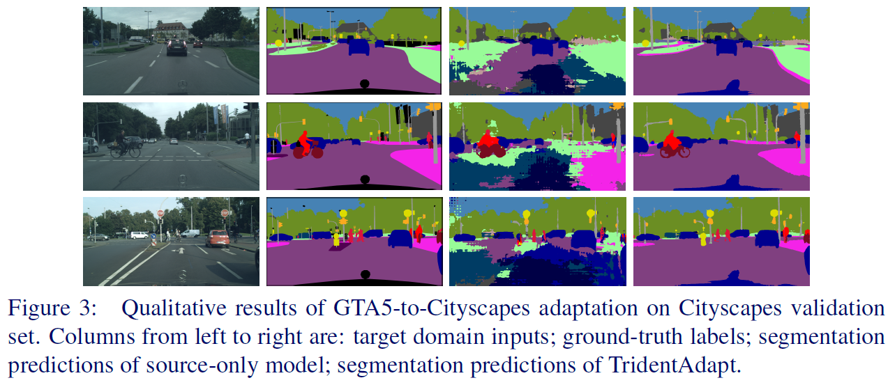

# TridentAdapt: Learning Domain-invariance via Source-Target Confrontation and Self-induced Cross-domain Augmentation (BMVC 2021, Official Pytorch implementation, [Paper Page](https://www.bmvc2021-virtualconference.com/conference/papers/paper_0921.html))

## Abstract
>Due to the difficulty of obtaining ground-truth labels, learning from virtual-world datasets is of great interest for real-world applications like semantic segmentation. From domain adaptation perspective, the key challenge is to learn domain-agnostic representation of the inputs in order to benefit from virtual data. In this paper, we propose a novel trident-like architecture that enforces a shared feature encoder to satisfy confrontational source and target constraints simultaneously, thus learning a domain-invariant feature space. Moreover, we also introduce a novel training pipeline enabling self-induced cross-domain data augmentation during the forward pass. This contributes to a further reduction of the domain gap. Combined with a self-training process, we obtain state-of-the-art results on benchmark datasets (e.g. GTA5 or Synthia to Cityscapes adaptation).





## Datasets
The data folder `/data` follows the original structure of each dataset (e.g. GTA5-->Cityscapes):
  ```
  |---data
      |--- Cityscapes
      |   |--- gtFine
      |   |--- leftImg8bit
      |--- GTA5
          |--- images
          |--- labels
  ```
## Usage

### Run Training Script: e.g. GTA5->Cityscapes 
### Stage1 (go to ./TridentAdapt_GTA5 folder)
```
python train_gta2city_stg1.py --gta5_data_path /data/GTA5 --city_data_path /data/Cityscapes
```
### After stage1, generate pseudo-labels and put in /data/Cityscapes for stage2 self-training
```
python pseudolabel_generator.py ./weights --city_data_path ./data/Cityscapes
```
### Stage2
```
python train_gta2city_stg2.py --gta5_data_path /data/GTA5 --city_data_path /data/Cityscapes
```
### Run Evaluation Script:
```
python evaluate_val.py ./weights --city_data_path /data/Cityscapes
```

### Pretrained Weights
We provide our pretrained models and generated pseudo labels:

[GTA5 Pseudo Labels](https://drive.google.com/file/d/1tJyPameytkrbcYsfjm3EG6Pats2JzNIT/view?usp=sharing),

[GTA5 final model](https://drive.google.com/file/d/1rtZUDPIthlnvQcaPCbX-O0ydXrrikHvp/view?usp=sharing) (peaked at 53.5 mIoU).

[Synthia Pseudo Labels](https://drive.google.com/file/d/1SqEMtKxaEAfNGUzpTRCvoRg9bzRaLYWO/view?usp=sharing),

[Synthia final model](https://drive.google.com/file/d/1s04T-YXkbezxdQByHzo1LfUxQSru_Pks/view?usp=sharing) (54.4 mIoU/13 Classes).

## Citation
If you like this work and would like to use our code or models for research, please feel free to cite as follows.
```
@article{shen2021tridentadapt,
  title={TridentAdapt: Learning Domain-invariance via Source-Target Confrontation and Self-induced Cross-domain Augmentation},
  author={Shen, Fengyi and Gurram, Akhil and Tuna, Ahmet Faruk and Urfalioglu, Onay and Knoll, Alois},
  journal={arXiv preprint arXiv:2111.15300},
  year={2021}
}
```
## Acknowledgement
Our implementation is inspired by [AdaptSeg](https://github.com/wasidennis/AdaptSegNet) and [DISE](https://github.com/a514514772/DISE-Domain-Invariant-Structure-Extraction).
